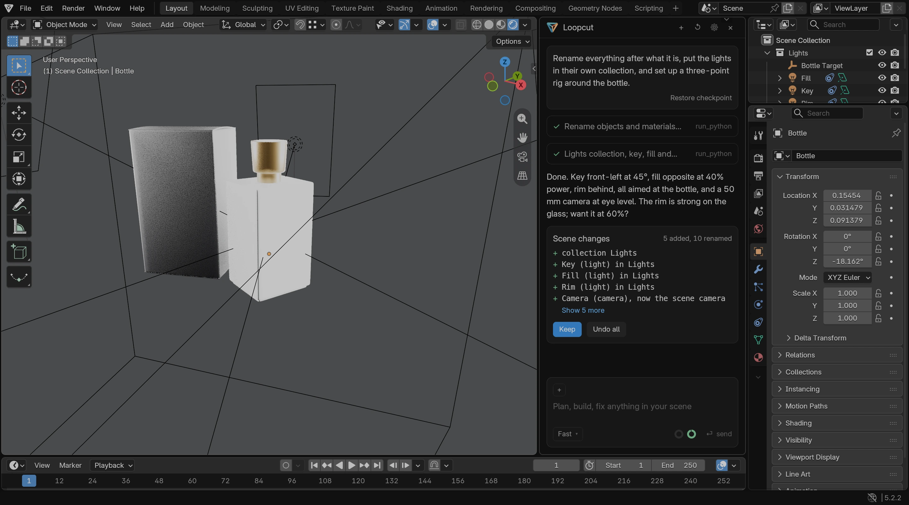

<p align="center">
  <a href="https://loopcut.org">
    <picture>
      <source media="(prefers-color-scheme: dark)" srcset=".github/readme/lockup-dark.png">
      
    </picture>
  </a>
</p>

<h3 align="center">You're the artist. Loopcut's the technician.</h3>

<p align="center">
  An open-source AI agent inside Blender. Describe the technical work in a sentence; Loopcut writes and runs the Python, shows you every step, checks the viewport, and leaves the creative decisions to you.
</p>

<p align="center">
  <a href="https://loopcut.org">Website</a> ·
  <a href="https://github.com/Samffprice/loopcut/releases/latest">Download</a> ·
  <a href="#install">Install</a> ·
  <a href="#your-model-or-ours">Models</a> ·
  <a href="loopcut/DEVELOPING.md">Developer guide</a> ·
  <a href="https://loopcut.org/pricing">Pricing</a>
</p>

<p align="center">
  <a href="https://github.com/Samffprice/loopcut/releases/latest"></a>
  <a href="https://github.com/Samffprice/loopcut/actions/workflows/tests.yml"></a>
  <a href="https://github.com/Samffprice/loopcut/releases"></a>
  
  
  <a href="COPYING"></a>
</p>

<p align="center">
  <a href="https://loopcut.org"></a>
</p>

## What it does

- **The technical work, in a sentence.** Rename by material, sort into collections, fix normals, stack modifiers in the right order, wire constraints and drivers, unwrap and pack, build a light rig, set up render presets, batch export. Each of these is one message.
- **Every step on screen.** The code for each step waits for your approval before it runs (or you tell it to stop asking for this conversation). Its result is measured from the scene, not from what the model printed, so a "Scene changes" card lists exactly what was added, removed and changed.
- **It looks at its work.** The agent captures the viewport to check itself, and can put a reference photo you dropped on the panel next to a capture to compare and adjust.
- **One click back.** Every turn that changes the scene is a checkpoint. *Undo all* restores the scene and the conversation to before it. Your .blend is never written to; a restore lands in place, with the file still yours.
- **It knows the scene.** File, mode, selection and objects ride with every message, so "make this shinier" works. Type `@Name` to point at an object, material or collection. Installed add-ons are in its view, and it can use them.
- **Your model or ours.** Bring a key from any OpenAI-compatible provider, run a model on your own GPU, or sign in for hosted models with nothing to set up.
- **It's Blender.** Loopcut is Blender 5.2 with a panel and about forty changed files. Import your settings, add-ons, keymap and themes on first launch and carry on. It updates itself.

## Install

Grab the latest build from the [releases page](https://github.com/Samffprice/loopcut/releases/latest) or [loopcut.org/download](https://loopcut.org/download).

| Platform | File | Notes |
|---|---|---|
| macOS (Apple silicon) | `loopcut-<version>-arm64.dmg` | Drag to Applications. |
| Windows (64-bit) | `loopcut-<version>-windows64.msi` or `.zip` | The installer, or unzip anywhere. |

The builds are not yet signed, so the first launch needs one extra click:

- **macOS** says it "could not verify" Loopcut. Click *Done*, then *System Settings → Privacy & Security → Open Anyway*. Or, in Terminal: `xattr -dr com.apple.quarantine /Applications/Loopcut.app`.
- **Windows** shows a SmartScreen warning. *More info → Run anyway*.

On first launch, choose *Import Blender 5.2 Settings* to bring over your preferences, add-ons, keymap, themes and startup file, or *Start Fresh*. Then connect a model and you're in. The panel docks to the right of the 3D viewport; <kbd>⌘</kbd><kbd>L</kbd> (<kbd>Ctrl</kbd><kbd>Alt</kbd><kbd>L</kbd> on Windows) focuses it.

Later updates install from inside the app ("Restart to update") and never trigger the warning again.

## Your model or ours

| | |
|---|---|
| **Bring your own key** | Paste a key from any OpenAI-compatible provider. It stays on your machine, in a user-only file, and requests go straight to them. No account needed. |
| **Run it locally** | Point Loopcut at a model on your own GPU (Ollama, LM Studio, llama.cpp, vLLM…). Works offline; nothing leaves the building. |
| **Hosted by Loopcut** | Sign in from the app and start. *Fast* and *Pro* modes on models picked for Blender work. Free tier included; see [pricing](https://loopcut.org/pricing). |

With your own key or a local model, nothing touches our servers. With hosted models, the gateway relays the request and keeps token counts for billing, not prompts or scenes.

## What to ask it

```
Rename everything after what it is, put the lights in their own collection, and set up a three-point rig around the bottle.
```
```
Apply scale on everything, fix the flipped normals, and purge orphan data.
```
```
Add an IK chain to the legs with pole targets, and mirror the naming to .L/.R.
```
```
Match the framing of the reference photo I attached and set up a product-shot render preset at 2048².
```
```
Sort the modifier stack so Mirror comes before Subdivision on every mesh in Props.
```

## How a turn works

The model works with a small set of tools, and each one is built to tell the truth about the scene:

| Tool | What it's for |
|---|---|
| `run_python` | Change the scene. The result ends with the scene diff, measured after the run, and can carry a viewport capture in the same reply. |
| `get_scene_info` / `get_object_info` | What's in the scene, and how an object is set up: modifiers, material and geometry node trees, constraints, animation. |
| `inspect_api` | The Python API of the running Blender, with tested notes where recent versions differ from what models remember. |
| `capture_viewport` | A self-framed look at the scene from a chosen angle and shading style, and which objects are nearest. |
| `compare_with_reference` / `look_at_reference` | Your attached image beside a capture, or a region of it at full resolution. |

Drop images on the panel (or *+ image*) to attach up to six references per message. They are stored beside the conversation, never inside your .blend.

Conversations survive restarts and belong to the file they worked in; *History* lists the others, *New chat* starts fresh. Long sessions stay affordable: older steps are folded, and the model summarizes when needed, so the context shown in the footer stays within budget.

## Building from source

Loopcut is a fork of [Blender](https://projects.blender.org/blender/blender) 5.2.2 on the `main` branch. The add-on lives in `scripts/addons_core/loopcut/` and hot-reloads; the fork adds an editor type, in-place snapshot restore, a separate settings folder, and its own name and icons.

```
make update                       # fetches Blender's libraries from projects.blender.org
ninja -C ../build/lite install    # the dev build; the same command re-copies the add-on after Python-only changes
python3 -m unittest discover -s loopcut/tests
```

The [developer guide](loopcut/DEVELOPING.md) covers the layout, the dev loop, the harness and eval suite, releases, and how checkpoints, conversations and context management work inside.

## Contributing

Issues and pull requests are welcome. The fast loop is `loopcut/scripts/dev.sh` (Blender stays open, saving a file reloads the panel) and `python3 -m unittest discover -s loopcut/tests` runs without Blender. The Blender-free tests run on every push.

## License and name

The code is Blender's and ours together, under the GNU General Public License v3 or later, like Blender ([COPYING](COPYING), [doc/license/](doc/license/)). That includes the add-on: it is written against Blender's Python API and ships inside the app. The hosted model service is separate work in its own repository.

The license covers the code, not the name. "Loopcut" and the Loopcut mark ([release/loopcut/](release/loopcut/)) identify this product, and the GPL grants no right to use them; a fork of this repository needs its own name and icons, exactly as this one does not use Blender's. Blender is a trademark of the Blender Foundation. Loopcut is based on Blender and is not affiliated with or endorsed by the Blender Foundation.
